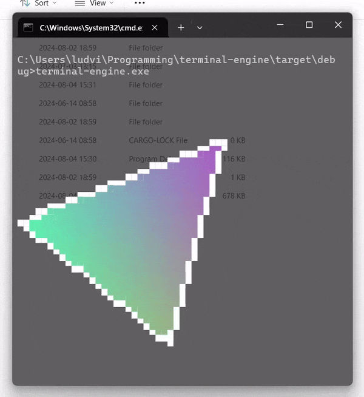

# terminal-engine

:exclamation: Windows users might need to enable UTF-8 support manually:
Language settings > Administrative language settings > Change system locale... > Beta: Use Unicode UTF-8

