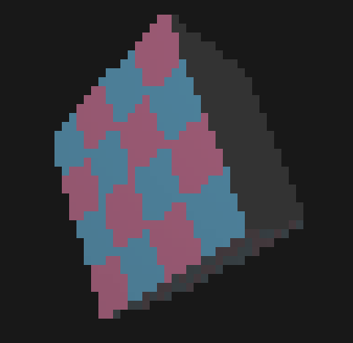
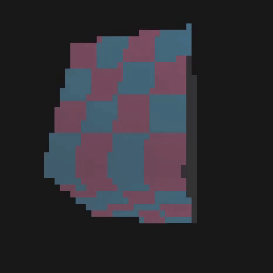
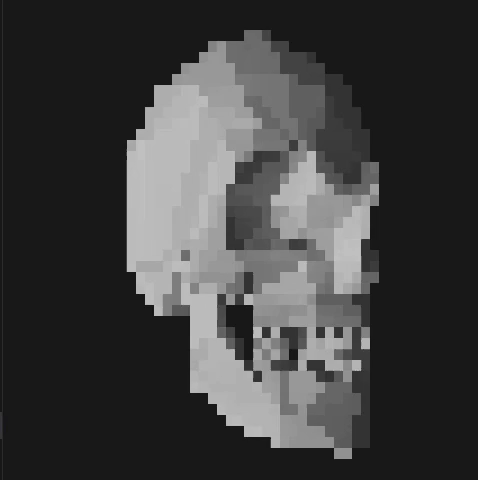
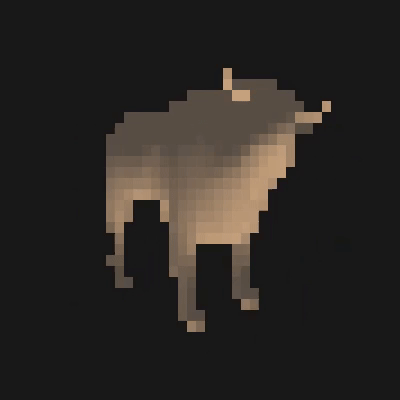

# Terminal User Interface 3D Renderer
## About
A lightweight terminal-based 3D software rasterizer from scratch that turns your console into a real-time rendering surface.
It draws 3D objects using ANSI escape sequences for color control and leverages UTF-8 Unicode characters for shading and resolution tricks.



## Features
- **Pure software rasterizer** — no GPU required, everything runs in the CPU.
- **ANSI escape sequences** — full control of cursor positioning, colors, and effects directly in the terminal.
- **UTF-8 Unicode shading** — uses block characters and symbols to simulate higher pixel density.
- **Minimal dependencies** — portable, runs in any modern terminal that supports ANSI/UTF-8.

## Use cases
- **Visualize** 3D meshes in the terminal.
- **Experiment** with low-level rendering techniques.
- **Learn** about rasterization, projection, and shading.

## Recordings
| Cube | Laughing Skull | Bull |
|:---|:---:|---:|
|  |  |  |

## Build & Run
Make sure you have Rust installed on your system. You can install it [here](https://rustup.rs/).
```sh
git clone https://github.com/ludvigsandberg/tui-3d-renderer.git
cd tui-3d-renderer
cargo build --release
cargo run --release
```

## License

MIT license.

